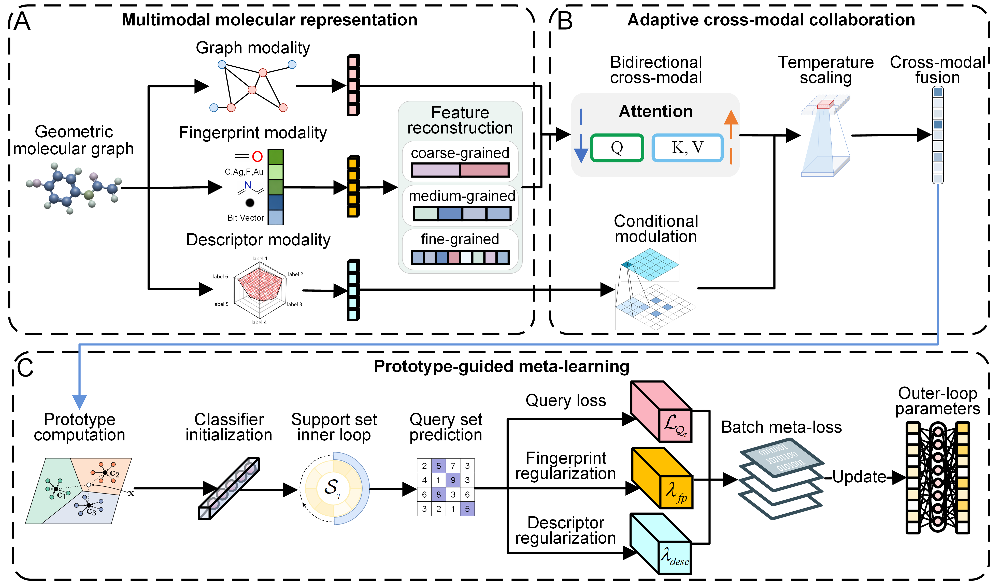

# MPGML

**Multimodal Prototype-Guided Meta-Learning for Few-Shot Molecular Property Prediction**

MPGML is a molecular learning framework for property prediction under limited supervision. Its model design combines atomic topology, substructural patterns, and global physicochemical attributes to learn complementary molecular representations and support rapid adaptation to new prediction tasks.

## Model overview



The MPGML architecture connects three stages: **multimodal molecular representation**, **adaptive cross-modal collaboration**, and **prototype-guided meta-learning**. Together, these stages combine chemical priors with task-adaptive learning to address noisy molecular representations and scarce property labels.

### Design highlights

1. **Chemical-prior-informed multimodal representation.** Molecular graphs capture atom and bond topology, fingerprints describe substructural and pharmacophoric patterns, and descriptors encode global physicochemical characteristics. These complementary views extend the information available for few-shot prediction.

2. **Structured fingerprint feature reconstruction.** The reconstruction design combines feature gating, multiscale bucket aggregation, and adaptive weighting across fingerprint types and scales. It organizes sparse fingerprint information into compact representations that emphasize relevant structural patterns and suppress redundancy.

3. **Adaptive cross-modal collaboration.** Bidirectional attention exchanges information between graph and fingerprint representations, while Transformer aggregation models their joint dependencies. Descriptor-conditioned modulation supplies global chemical context, and gated residual fusion preserves foundational molecular information.

4. **Prototype-guided task adaptation.** Support-set class prototypes provide task-specific classifier initialization. This design gives adaptation a discriminative starting point, with support-based refinement and query-based meta-optimization targeting effective learning from few labeled molecules.

The overview describes the MPGML model design. The following sections document the repository's data preparation, command-line interface, and experiment outputs.

## Repository structure

```text
MPGML/
├── assets/model-overview.png   # Model architecture diagram
├── run.py                      # Training and periodic evaluation
├── args_parser.py              # Shared command-line configuration
├── meta_learner.py             # Episode adaptation and outer optimization
├── experiment.py               # Logging, random seeds, and checkpoints
├── result_recorder.py          # Configuration and metric recording
├── explain.py                  # Modality sensitivity and feature projections
├── dataset/                    # Molecular features, task splits, and sampling
├── models/                     # Encoders, fusion, task modeling, and losses
├── data/README.md              # Dataset format and task definitions
├── pretrained/README.md        # Graph encoder checkpoint preparation
├── docs/                       # Technical reference
├── requirements.txt
├── requirements-explain.txt
└── THIRD_PARTY.md              # Component provenance
```

## Installation

Create a Python environment:

```bash
conda create -n mpgml python=3.10
conda activate mpgml
```

Core dependencies include PyTorch, PyTorch Geometric, RDKit, NumPy, scikit-learn, torch-scatter, learn2learn, TensorBoard, and tqdm. The dependency manifest specifies PyTorch 2.7.1 and PyTorch Geometric 2.6.1.

For a CUDA 12.6 environment:

```bash
python -m pip install torch==2.7.1 --index-url https://download.pytorch.org/whl/cu126
python -m pip install torch-scatter -f https://data.pyg.org/whl/torch-2.7.0+cu126.html
python -m pip install -r requirements.txt
```

Select the PyTorch build for your device using the [PyTorch installation instructions](https://pytorch.org/get-started/previous-versions/) and install matching extension wheels using the [PyG installation instructions](https://pytorch-geometric.readthedocs.io/en/latest/install/installation.html). For CPU, use the PyTorch `cpu` index and the extension index `torch-2.7.0+cpu.html`. Platform-specific learn2learn build instructions are available in its [repository](https://github.com/learnables/learn2learn).

For visualization and checkpoint interpretation, also install:

```bash
python -m pip install -r requirements-explain.txt
```

## Data preparation

The project supports **Tox21, SIDER, MUV, PCBA**, and nine **ToxCast** assay groups. Tasks use binary property labels and support/query episodes.

Place each prepared CSV at `data/<dataset>/<dataset>.csv`:

```text
data/
├── muv/muv.csv
├── tox21/tox21.csv
├── sider/sider.csv
├── pcba/pcba.csv
├── toxcast-TOX21/toxcast-TOX21.csv
└── toxcast-Tanguay/toxcast-Tanguay.csv
```

ToxCast group names are `toxcast-APR`, `toxcast-ATG`, `toxcast-BSK`, `toxcast-CEETOX`, `toxcast-CLD`, `toxcast-NVS`, `toxcast-OT`, `toxcast-TOX21`, and `toxcast-Tanguay`. Select an individual group with `--dataset`.

CSV column order determines task IDs and train/test task partitions. See [data preparation](data/README.md) for the exact column layout, task definitions, feature construction, and sampling rules.

Graph and molecular-feature caches are generated under each dataset's `processed/` directory. Use `--rebuild_feature_cache` to regenerate fingerprint and descriptor features. After changing the underlying CSV or graph preprocessing, rebuild the dataset's full processed cache as described in the data guide.

## Pretrained graph encoder

Place the backbone state dictionary at:

```text
pretrained/supervised_contextpred.pth
```

The training presets use a five-layer GIN with 300-dimensional embeddings, batch normalization, and mean graph pooling. See [checkpoint preparation](pretrained/README.md) for the expected architecture and artifact details.

Use `--mol_pretrain_load_path` to specify another compatible backbone, or `--no_pretrain` for training from scratch.

## Training

Run from the project root:

```bash
python run.py \
  --dataset "$dataset" --random_seed "$seed" --n_support 10 --gpu "$gpu" \
  --mol_pretrain_load_path ./pretrained/supervised_contextpred.pth \
  --inner_lr "$inner_lr" --meta_lr "$meta_lr" --ib_ratio 5e-2 --dump_path dump \
  --use_fingerprint --use_descriptor --fp_type mixed --fp_encoder_type typewise \
  --fusion_method transformer --fusion_layers 3 --use_cross_modal_attn --use_l2_norm
```

## Key options

| Option | Default | Description |
| --- | --- | --- |
| `--dataset` | `sider` | Dataset |
| `--n_support` | `10` | Support examples per class when available |
| `--n_query` | `16` | Training query count and evaluation-adaptation batch size |
| `--pool_num` | `5` | Training tasks sampled per outer update |
| `--episode` | `2000` | Number of outer updates |
| `--inner_update_step` | `1` | Support adaptation steps |
| `--second_order` | `1` | Second-order meta-gradients |
| `--eval_step` | `100` | Evaluation interval in outer updates |
| `--test_batch_size` | `64` | Evaluation query batch size |
| `--use_fingerprint` | off | Enable fingerprint features |
| `--use_descriptor` | off | Enable molecular descriptors |
| `--fp_encoder_type` | `typewise` | Fingerprint encoding strategy |
| `--fusion_method` | `transformer` | Modality fusion operator |
| `--fusion_layers` | `2` | Transformer depth; the presets use 3 |
| `--use_cross_modal_attn` | off | Enable attention between modality tokens |
| `--use_l2_norm` | off | Normalize and scale the fusion output |
| `--fp_gate_reg`, `--desc_gate_reg` | `0` | Feature-gate regularization coefficients |

Both additional modalities, cross-modal attention, and L2 normalization are enabled by the supplied launchers. Attention requires the embedding width to be divisible by the head count. Keep graph architecture settings consistent with the selected pretrained checkpoint.

For the complete interface:

```bash
python run.py --help
```

## Evaluation and experiment records

Evaluation adapts to each held-out property task using its support set and predicts the remaining labeled query molecules. Task ROC-AUCs are averaged with equal weight. The runner saves the checkpoint with the highest observed held-out-task mean.

Run outputs are organized as:

```text
dump/<dataset>/<n_support>/rel_ratio_<value>_ib_ratio_<value>/<MMDD>-<exp_name>/<exp_id>/
```

| Output | Contents |
| --- | --- |
| `config.json` | Resolved configuration and invocation |
| `train.log`, `model.describe` | Training log and module structure |
| `metrics.csv` | Losses, timing, and evaluation scores |
| `train_task_samples.csv` | Sampled target and auxiliary task IDs |
| `eval_task_scores.csv` | Per-task ROC-AUC |
| `run_command.txt`, `run_command.csv`, `run_config.csv` | Command and configuration records |
| `summary.csv`, `summary.txt` | Run summaries |
| `tensorboard/` | TensorBoard events |
| `best_model.pkl` | Best model state dictionary |
| `last_model.pkl` | Final state dictionary when requested |

The parent experiment group also records `run_commands.csv` and `run_summaries.csv`. Model checkpoints store parameter and buffer state. Preserve the corresponding configuration and data when sharing a checkpoint.

## Interpretability

Analyze a trained checkpoint with:

```bash
python explain.py \
  --run_dir "path/to/run" \
  --projection_method both --max_tasks 3 --max_query_per_task 200
```

The analysis workflow provides modality masking sensitivity, feature-gate weights, prediction changes, and PCA/t-SNE projections of molecular representations. It restores the run configuration and complete model checkpoint before task adaptation.

Modality masking sets the selected query embedding to zero before fusion while keeping support representations fixed. The resulting probability and logit changes quantify sensitivity to that modality. Use `--max_tasks 0 --max_query_per_task 0` to analyze all selected tasks and query molecules.